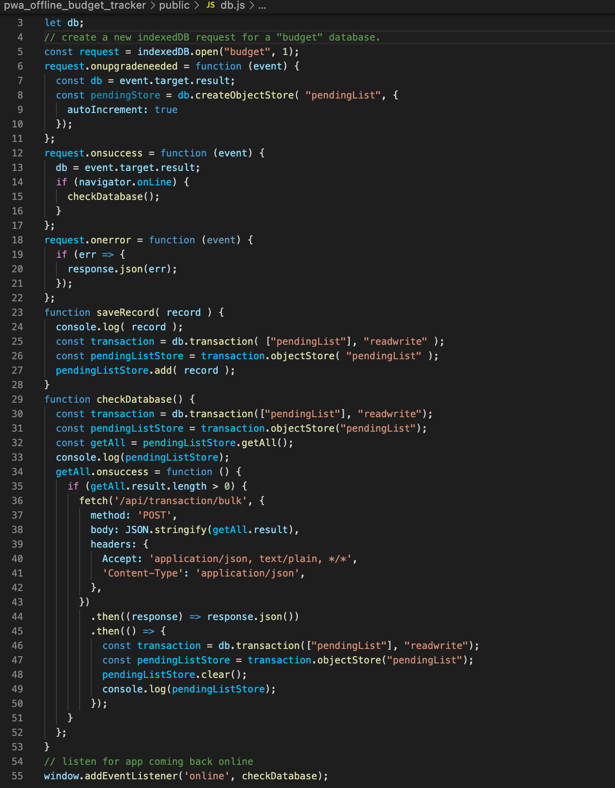

# Progressive Web Application: Budget Tracker 

## Table of Contents
1. [ Description ](#desc)
2. [ Task ](#task)
3. [ Link to Heroku deployment ](#link)
4. [ Structure ](#structure)
5. [ Finished product ](#final)
6. [ Contact details ](#contact)

## 1. Description
This is a full-stack progressive web application for tracking expenses and earnings and allows offlines functionality . It allows to add and visualize transactions, and view the overall budget. Developed using MongoDB for backend and JS for frontend. The application is deployed to Heroku using MongoDB Atlas. 

## 2. Task
Task is to build a budget tracker that allows user to add and visualize transactions, and view the overall budget. Transactions are visualized as an area chart. The application allows offline functionality which means that if during the moment when the user makes a transaction the network fails, the transactions are temporarily being saved to an IndexedDB, and later pushed to MongoDB, when the network is back.
Backend  app contains two POST routes for insering a single and several transactions and one GET route to view the transactions. Bulk POST route is needed if several transactions took place during the time when the network was down. Frontend contains a functionality to implement indexedDB.  

## 3. Link to Heroku deployment 
The project is deployed on Heroku and available for view using this link:
https://pwa-offline-budget-tracker.herokuapp.com/

## 4. Structure
The repo contains a set of files and folders responsible for backend functionality. Files responsible for frontend functionality are located in a public folder.

Models folder contains *transactions.js* which initializes the schema. Schema represents the document properties that are saved to the database.Routes folder contains *api.js* which is responsible for displaying and posting the data to the database. 
.
*Server.js* that is located in the root folder stores all the dependensies and connects to the port.
.
Public folder contains HTML file, *index.js* that is responsible for main frontend functionality and *db.js* which implements indexedDB for offline functionality.
.

## 5. Finished product
The final application looks like this:

When the network fails, the transaction is being saved in indexedDB:

## 6. Contact details
If you have any questions, contact me via email: 

